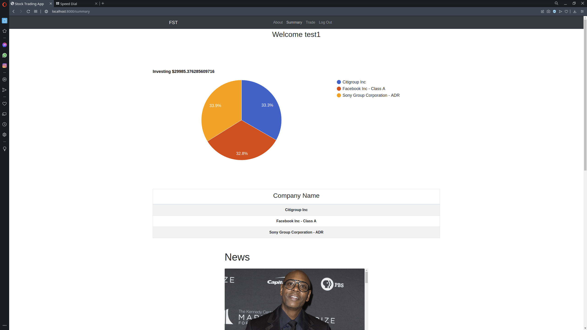
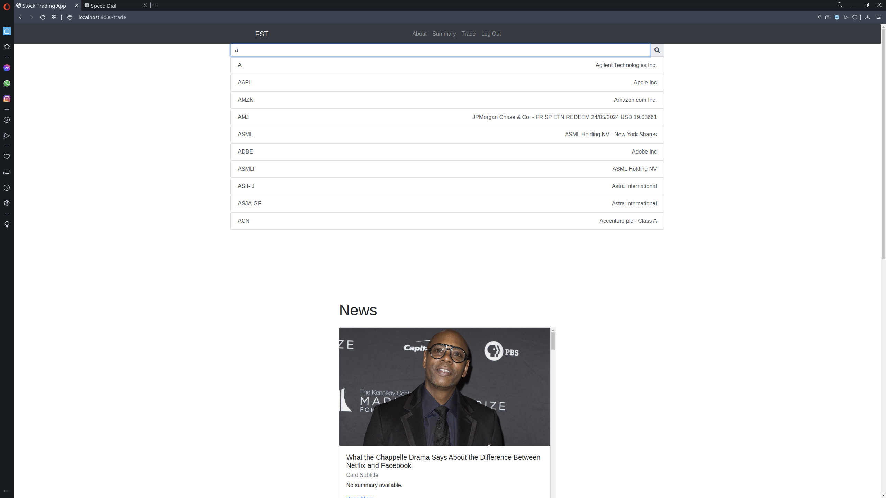
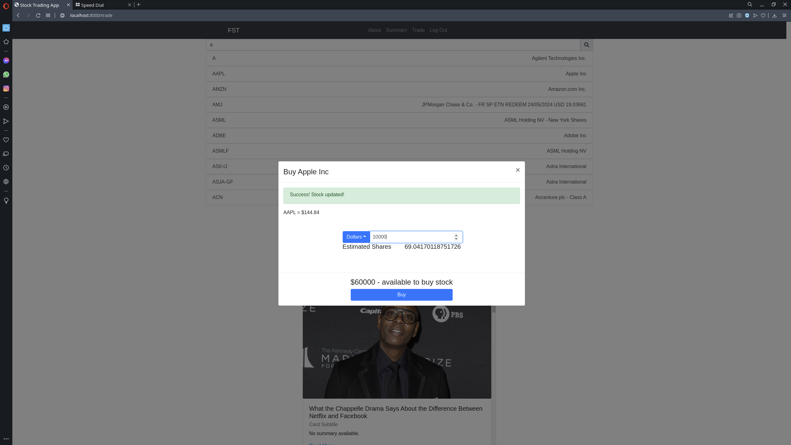
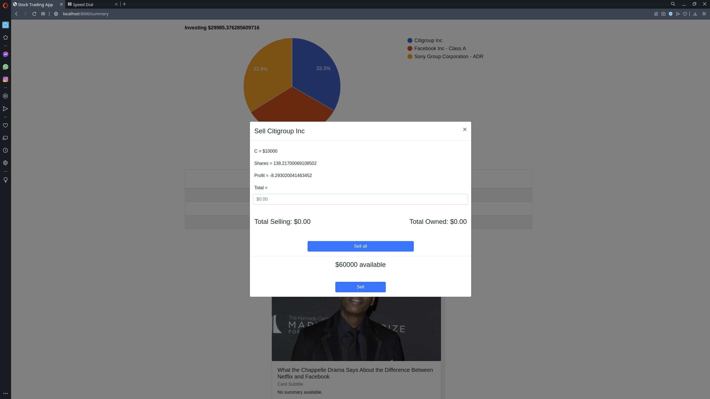

# Stock Trading App W/ Django

- This application was previously built using Python/Flask, which it's repo can be found [Github](https://github.com/jonathanj101/Stock-Trading-App) and live app [Heroku](https://fantasy-stock-trading-app.herokuapp.com)
- Currently, built using Django Framework for the server side and React for the client side as well as Google Charts.
- Added new features as;
    - Better search results
    - Better reports in what user is currently investing and the total
    - Updating users with news articles on their Home/Trade/Summary pages
    - And an e-mail receipt of each transactions made, sent directly to the user's email account.

## Report or Summary page

## Search Component 

## Buy/Sell Modal

## Summary

The reason to re-made this project was to understand and go in depth about Django Framework. Thus, knowing it's capabilities more thorough and it's weaknesses as a framework. I needed to figure out a way to handle "unknown" routes or url that Django does not recognized. This led me to create a url on the server that when Django recieves a request with an unrecognizable url pattern, the server will send it to React (client side) where these type of scenario would be handle more easier. 

